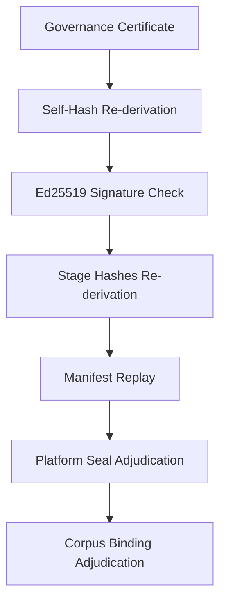

# Concepts and Vocabulary

Understanding the verification surface of `tenant-tail` requires familiarity with its domain vocabulary.

:::note Hard Invariants
`tenant-tail` enforces three load-bearing invariants:
1. **Offline:** It makes no network calls. A JWKS is a saved file.
2. **Identity-free:** It holds no signing keys and never signs or mints new claims.
3. **Read-only:** It never writes into the audited project. The provenance report goes to stdout.
:::

## Governance Certificate

A **governance certificate** is a JSON artifact asserting the state of a build. It contains a self-hash, an Ed25519 signature, stage artifact hashes, an inter-stage manifest chain, and an optional platform countersign.

## Certificate Verification

**Certificate verification** is the process of re-deriving the certificate self-hash, verifying the Ed25519 signature, re-deriving stage artifact hashes, replaying the manifest, and adjudicating seals and corpus bindings.

## Platform Countersign

A **platform countersign** is an optional JWS signature applied by the platform admitting the run. A certificate can be **sealed** (countersign verified against a JWKS) or **unsealed** (no countersign). By default the verifier requires a verifiable seal and rejects an unsealed certificate (exit `1`); `--allow-unsealed` opts out, reporting the unsealed state as a visible notice (exit `0`).

## Corpus Binding States

A certificate may carry a reference to a corpus attestation. The **corpus binding states** are:

| State | Description |
|---|---|
| `unbound` | No corpus binding is present on the certificate. |
| `present-but-unverified` | Binding is present, but no attestation file was supplied to check the link. |
| `verified` | Binding is present and the supplied attestation matches the claimed hash. |
| `mismatch` | Binding is present but the supplied attestation does NOT match the claim. |

## Claim Provenance

**Claim provenance** is the traceability of assertions (claims) back to an extraction corpus or an explicit assumption.

## Assumption Budget

An **assumption budget** defines the limits on un-cited claims (`ASSUMPTION` tags) allowed in a project.

## Artifact-Hash Mismatch

An **artifact-hash mismatch** occurs when the re-derived hash of an on-disk artifact does not match the hash recorded in the governance certificate.

## Inter-Stage Manifest Chain

The **inter-stage manifest chain** is a cryptographically linked sequence of manifests passed between build stages.

## Tamper-Evident Audit Chain

A **tamper-evident audit chain** ensures that any modification to a build artifact or certificate invalidates the signature and hashes.

## Do-Not-Trust-The-Producer

The **do-not-trust-the-producer** posture means the verifier independently re-derives hashes and checks signatures, assuming nothing about the system that produced the certificate.

## Verification Pipeline

